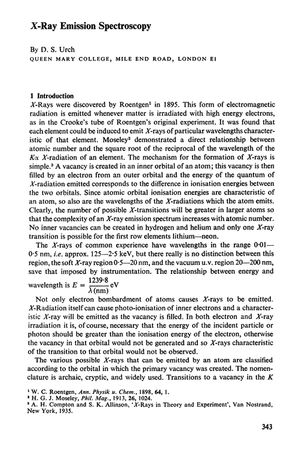
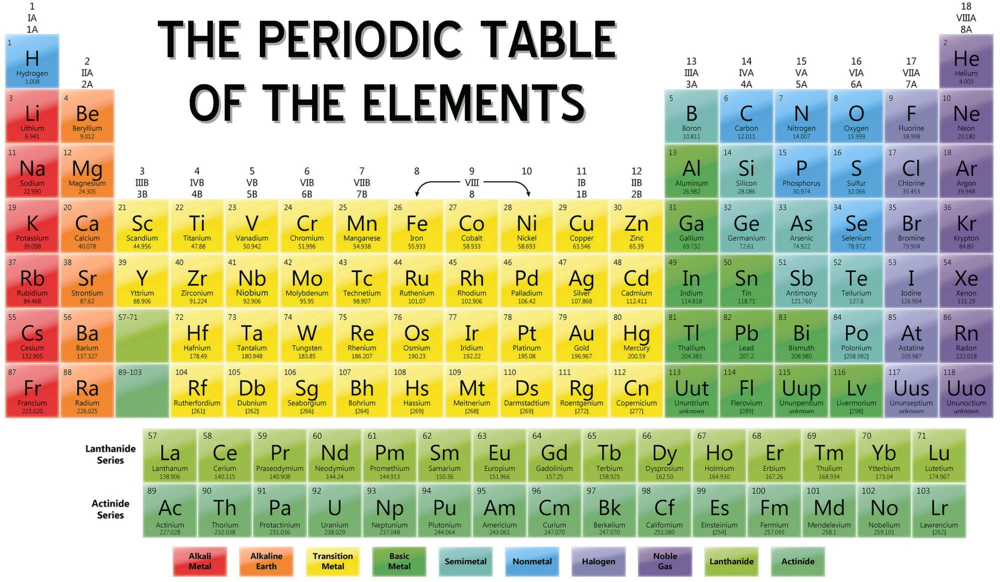

[Back to all lessons](.)

# Assorted Topics for June Midterm

## X-Ray Emission

* [Text from here](http://pubs.rsc.org/-/content/articlelanding/1971/qr/qr9712500343#!divAbstract)
* [How are x-rays produced?](https://www.nobelprize.org/educational/physics/x-rays/how-1.html)

## Emission and Absorption Spectra

<iframe width="560" height="315" src="https://www.youtube.com/embed/1uPyq63aRvg" frameborder="0" allow="autoplay; encrypted-media" allowfullscreen></iframe>

## What is a laser? How do lasers work?

<iframe width="560" height="315" src="https://www.youtube.com/embed/y3SBSbsdiYg" frameborder="0" allow="autoplay; encrypted-media" allowfullscreen></iframe>

<iframe width="560" height="315" src="https://www.youtube.com/embed/oUEbMjtWc-A" frameborder="0" allow="autoplay; encrypted-media" allowfullscreen></iframe>

## Periodic Table of the Elements

Types of decay:

* $\alpha$-decay emits an **alpha particle** (Helium nucleus) consisting of **two protons and two neutrons**
* $\beta$-decay emits an electron (or positron) and a neutrino. **When a neutron undergoes beta decay, it turns into a proton**. (Alternatively, a proton can be converted into a neutron by emitting a positron, which is also $\beta$-decay.)
* $\gamma$-decay emits the highest frequency of photons of any other known process.
