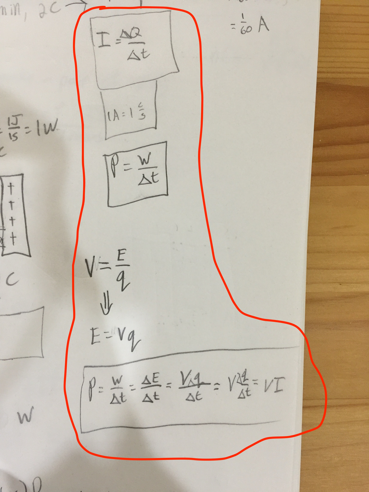

[Back to all lessons](.)

# What is a Circuit

Pages 431-445 in your textbook cover this material.

## Introduction to Circuits

* 0:45-1:09 Voltage and charge "flowing downhill"
* 1:10-1:35 History of electrodes
* 1:35-2:04 Most basic possible circuit
* 2:05-2:28 What is current?
* 2:28-3:15 "Why do we consider the flow of *positive* charges?!" (Benjamin Franklin thing)
* 3:15-3:48  Terminals of battery - "high" and "low" potential
* 3:48-4:58 Resistance and Ohm's Law: $R = \frac{V}{I}$
* 4:58-5:33 Resistors and Superconductors
* 5:33-6:38 Power of circuit! (see **&hearts;Derivation** below of $P=VI$ from 6:16-6:26)
* 6:38-7:21 How to measure resistance and power

<iframe width="560" height="315" src="https://www.youtube.com/embed/HXOok3mfMLM?rel=0&amp;start=43" frameborder="0" allow="autoplay; encrypted-media" allowfullscreen></iframe>

**&hearts;Derivation** of $P = VI$

For this derivation, [recall](potential.html#units-of-electric-field-vm-or-nc) that $V = \frac{PE}{q}$ (*voltage is energy per unit charge*), and so $Vq = Pe$. If the voltage is fixed and charge is changing, the change in potential energy of that charge is $\Delta PE = V\Delta q$.

$$
\begin{align\*}
P &= \frac{W}{\Delta t}\\\\
&=\frac{\Delta PE}{\Delta t}\\\\
&= \frac{\Delta q V}{\Delta t}\\\\
&=\underbrace{\frac{\Delta q}{\Delta t}}\_{I = \frac{\Delta q}{\Delta t}}V\\\\
&= IV
\end{align\*}
$$

	 
	We did this <em>exact</em> derivation <em>today</em> (4/24/18)! This video is your second time seeing it!  

## DC Resistors and Batteries

<iframe width="560" height="315" src="https://www.youtube.com/embed/G3H5lKoWPpY" frameborder="0" allow="autoplay; encrypted-media" allowfullscreen></iframe>

<iframe width="560" height="315" src="https://www.youtube.com/embed/g-wjP1otQWI" frameborder="0" allow="autoplay; encrypted-media" allowfullscreen></iframe>

## Series and Parallel Circuits - Circuit Analysis

<iframe width="560" height="315" src="https://www.youtube.com/embed/-w-VTw0tQlE?rel=0" frameborder="0" allow="autoplay; encrypted-media" allowfullscreen></iframe>
