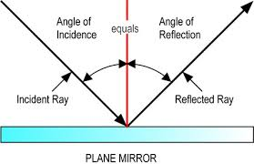

[Back to all lessons](.)

# Light and Energy
Textbook chapters 26-27.

* Absorption Spectra - composition of atmospheres of planets

## Crash Course 38 - *Geometric Optics*

* 1:45 Law of Reflection (Angle of Incidence = Angle of Reflection; $\theta_i = \theta_r$) 
* 2:45 Law of Refraction $n_1sin\theta_1 = n_2sin\theta_2$ and $n = \frac{c}{v}$
* 3:15 Images through refraction
* 3:47 Real Images
* 4:15 Intro to lenses
* 4:45 Convex Lenses
* 7:00 Images inverted through convex lenses
* 7:05 Thin Lens Equation (Image Distance and Focal Length) $\frac{1}{d_{Obj}} + \frac{1}{d_{Im}}=\frac{1}{f}$
* 7:30 Diverging Lenses
* 8:16 Magnification Equation $m = \frac{h_i}{h_o} = \frac{d_i}{d_o}$

<iframe width="560" height="315" src="https://www.youtube.com/embed/Oh4m8Ees-3Q?rel=0" frameborder="0" allow="autoplay; encrypted-media" allowfullscreen></iframe>

## Crash Course 39 - *Light is Waves*

* 1:00-2:50 Light is a wave because it undergoes ***diffraction***
* 2:50 Light is not like a particle because it undergoes diffraction
* 3:15 Interference and the *double slit experiment*

<iframe width="560" height="315" src="https://www.youtube.com/embed/IRBfpBPELmE?rel=0&amp;start=60" frameborder="0" allow="autoplay; encrypted-media" allowfullscreen></iframe>

## Why does light travel slower in glass?

Physics professors talking about light passing through glass.

## Refraction and Total Internal Reflection Applet

<iframe width = "800" height="500" src="https://phet.colorado.edu/sims/html/bending-light/latest/bending-light_en.html"></iframe>

## Ripple Tank to Observe Interference

<iframe width="800" height="500" src="https://www.falstad.com/ripple/Ripple.html" frameborder="0" allowfullscreen></iframe>

## What is a *Diffraction Grating*?

<iframe width="560" height="315" src="https://www.youtube.com/embed/flPSbngdLwI" frameborder="0" allow="autoplay; encrypted-media" allowfullscreen></iframe>

