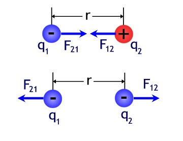

# What is Electric Potential?

Read about Electric Force ($F_E$), Electric Field ($E$), Electric Potential Energy ($PE_E$ or $U$), and Potential Difference ($\Delta V$), and it will become clearer.

## Electric Force - Coulomb's Law

*Coulomb's Law* states that the Electric Force ($F_E$) between two charged particles (with charges $q_1$ and $q_2$), separated by a distance ($r$) is:

$$F_E = \frac{kq_1 q_2}{r^2}$$

Distance is measured in *meters* ($m$), charge is measured in *coulombs* ($C$), and Force is measured in *newtons* ($N$). The constant $k$ is equal to $9\times 10^9 \frac{Nm^2}{C^2}$.

We see that the Force

## Videos

### Visual Analogy to Gravitational Potential (which depends on height and is realized through "falling")
<iframe width="560" height="315" src="https://www.youtube.com/embed/-Rb9guSEeVE?rel=0" frameborder="0" allow="autoplay; encrypted-media" allowfullscreen></iframe>

### Blackboard Explanation

<iframe width="560" height="315" src="https://www.youtube.com/embed/wT9AsY79f1k?rel=0" frameborder="0" allow="autoplay; encrypted-media" allowfullscreen></iframe>

## Capacitance, Electric Field, Voltage
### (and cool British woman)

<iframe width="560" height="315" src="https://www.youtube.com/embed/ZrMltpK6iAw?rel=0" frameborder="0" allow="autoplay; encrypted-media" allowfullscreen></iframe>
