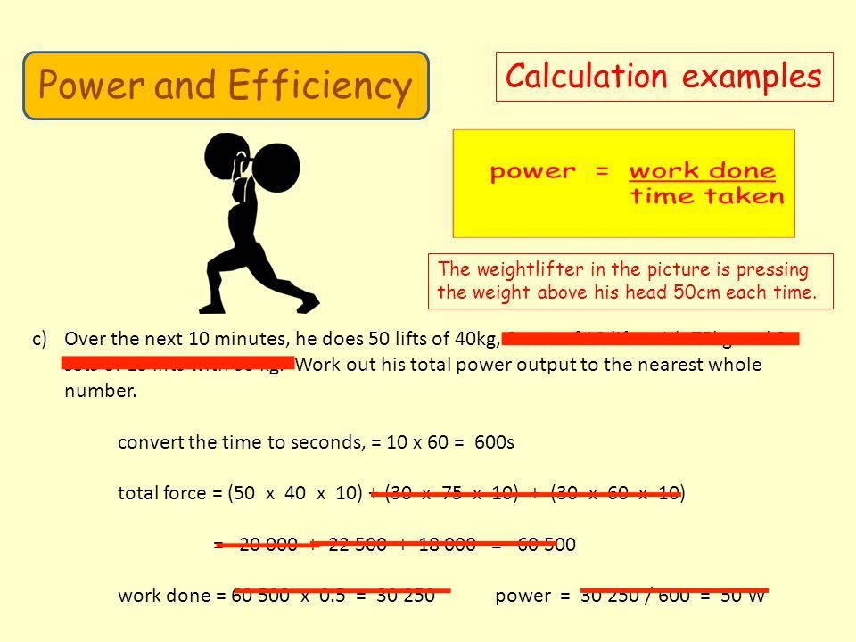

# Electric Force, Electric Field, Electric Potential Energy, Electric Potential?

Read about Electric Force ($F_E$), Electric Field ($E$), Electric Potential Energy ($PE_E$ or $U$), and Potential Difference ($\Delta V$), and it will become clearer.

## Review of Work and Power!

### Work
$$W = F \times d$$

The weight (downward force due to gravity) exerted by a dumbell is $80 N$. If you push against that $80 N$ over a distance of $1 m$, the work you have exerted is

$$
\begin{align\*}
W &= \overbrace{(80 N)}^\text{Force} \times \overbrace{(1m)}^\text{distance} \\\\
&= 80 Nm\\\\
&= 80 J
\end{align\*}
$$

The unit $1 J$ is $1$ *Joule*, which is equal to $1$ *Newton Meter*, which is $(1N)\times (1m)$. $1J$ is the amount of work (energy) required to push against a $1N$ force over a distance of $1m$.

### Power

$$P = \frac{W}{\Delta t}$$

	 
	This image uses an approximate value of $10m/s^2$ for gravity.  

* The downward **force** exerted by a $40kg$ dumbell is $\overbrace{(40kg)\times(9.8m/s^2)}^{F_g = mg} = 392 N$.

* The **work** required to push that dumbell up $50cm$ ($0.5 m$) is $\overbrace{(392 N)\times(0.5m)}^{W=Fd}=196 J$.

* After $50$ reps, $50\times 196 J =9800J$ of work has been done.

* The power of this lifter over $600 s$ (10 minutes) was
$$
\begin{align\*}
P &= \overbrace{\frac{9800J}{600s}}^{P=\frac{W}{\Delta t}}\\\\
&\approx 16.3 J/s\\\\
&= 16.3 W
\end{align\*}
$$

The unit $1 W$ is $1$ *Watt*, which is equal to $1$ *Joule per Second*, which is $\frac{1J}{1s}$. $1W$ is the rate of energy per unit time required to do $1J$ of work over $1s$.

### Video on Work and Power!

* Excellent explanation of **work** from 0:57-3:13
* **Work and Energy** (mostly **Kinetic Energy**) 3:13-4:23
* **Gravitational Potential Energy** 4:23-5:24
* **Potential Energy in a Spring** 5:25-6:26
* (SKIP) Conservative Systems and Pendulums 7:00-7:45
* **Power** 7:51-9:12

<iframe width="560" height="315" src="https://www.youtube.com/embed/w4QFJb9a8vo?rel=0&amp;start=42" frameborder="0" allow="autoplay; encrypted-media" allowfullscreen></iframe>

## Electric Force - Coulomb's Law, Electric Field

*Coulomb's Law* states that the Electric Force ($F_E$) between two charged particles (with charges $q_1$ and $q_2$), separated by a distance ($r$) is:

$$F_E = \frac{kq_1 q_2}{r^2}$$

Distance is measured in *meters* ($m$), charge is measured in *coulombs* ($C$), and Force is measured in *newtons* ($N$). The constant $k$ is equal to $9\times 10^9 \frac{Nm^2}{C^2}$.

Newton's Third Law tells us that for every force there is an equal and opposite force. We see that the force on particle 2 ($F_{12}$) is equal in magnitude and opposite in direction to the force on particle 1 ($F_{21}$).

If we write coulomb's law slightly differently, we can see that the force on a particle is proportional to its own charge:

$$F_{12} = \frac{kq_1}{r^2} \times q_2$$

and so

$$F_{12}\propto q_2$$

That is, if we *double* $q_2$, we *double* $F_{12}$; if we *triple* $q_2$, we *triple* $F_{12}$, etc..

If we think separately about the effect of particle 1 at distance $r$, and particle 2's charge, we see:

$\underbrace{F_{12}}\_\text{Force on particle 2} =  \underbrace{\frac{kq_1}{r^2}}\_\text{effect of particle 1 at distance $r$} \times q_2$

We call the effect of particle 1 at distance $r$ the *electric field* due to particle 1,

$$E_1 = \underbrace{\frac{kq_1}{r^2}}_{\text{effect of particle 1 at distance $r$}}$$

which allows us to refer to the force on particle 2 ($F_{12}$) as:

$$
\begin{align\*}
F_{12} &= \frac{kq_1}{r^2} &\times q_2 \\\\
&= \underbrace{E_1}_\text{effect of particle 1 at distance $r$} &\times q_2 \\\\
\end{align\*}
$$

This gives the equation

$$F = Eq$$

where $E$ depends on *charge somewhere*, but $q$ refers to the charge of the particle experiencing the force.

We can also rearrange this as

$$ E = \frac{F}{q}$$

to **characterize Electric Field as *Force per unit charge* **.

Force has units *newtons* ($N$), charge has units *coulombs* ($C$), and electric field has units *newtons per coulomb* ($\frac{N}{C}$).

### Video on Electric Field (watch it!)

* 1:20-2:30 is about $E=\frac{F}{q}$
* 2:30-6:00 is an **excellent** explanation of *electric field lines*
* 6:00-6:45 introduces capacitors
* 6:45-7:50 explains why **the electric field inside a conductor is $0$*.

<iframe width="560" height="315" src="https://www.youtube.com/embed/mdulzEfQXDE?rel=0&amp;start=80" frameborder="0" allow="autoplay; encrypted-media" allowfullscreen></iframe>

## What is Electric Potential?

### Video on Electric Potential

* 0:52- what is a capacitor?

<iframe width="560" height="315" src="https://www.youtube.com/embed/ZrMltpK6iAw?start=51" frameborder="0" allow="autoplay; encrypted-media" allowfullscreen></iframe>

## Videos

### Visual Analogy to Gravitational Potential (which depends on height and is realized through "falling")
<iframe width="560" height="315" src="https://www.youtube.com/embed/-Rb9guSEeVE?rel=0" frameborder="0" allow="autoplay; encrypted-media" allowfullscreen></iframe>

### Blackboard Explanation

<iframe width="560" height="315" src="https://www.youtube.com/embed/wT9AsY79f1k?rel=0" frameborder="0" allow="autoplay; encrypted-media" allowfullscreen></iframe>

## Capacitance, Electric Field, Voltage
### (and cool British woman)

<iframe width="560" height="315" src="https://www.youtube.com/embed/ZrMltpK6iAw?rel=0" frameborder="0" allow="autoplay; encrypted-media" allowfullscreen></iframe>
