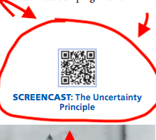

[Back to all lessons](.)

# Quantum Electrodynamics

[More about the Dual Nature of Particles and Waves](dual_nature.html)

## Basic Descriptions of Quantum Phenomena

**Only watch 5:20-10:30**

* Particle-Wave Duality 5:50-6:45
* Quantum Tunneling 6:45-8:00
* Superposition 8:00-8:53
* "No one really understands quantum physics" 9:45-10:28

<iframe width="560" height="315" src="https://www.youtube.com/embed/ARWBdfWpDyc" frameborder="0" allow="autoplay; encrypted-media" allowfullscreen></iframe>

## Where are we in our understanding of Quantum Electrodynamics?

Scientists have demonstrated through experiments that classical mechanics do not describe the behavior of subatomic particles. The [double slit experiment](https://www.youtube.com/watch?v=DfPeprQ7oGc&t=56s) and [measurements of quantum spin](https://www.youtube.com/watch?v=ZuvK-od647c) demonstrate behavior of particles that is *probabalistic*, rather than *deterministic*, which classical mechanics does not predict.

*Quantum Electrodynamics* (QED) can describe this behavior! But we still don't have much practical technology that utilizes QED, nor can we replicate these experiments in small labs. Still, QED describes the behavior of particles perfectly, and it's our job to learn to speak that (mathematical) language in order to understand these particles.

For now, our understanding of QED is about where our understanding of *electricity* was in the 18th century.

	Excerpt from Ben Franklin's pivotal <em>Experiments and Observations on Electricity</em> (1751):
	<iframe src='https://archive.org/stream/experimentsobser00fran?ui=embed#page/13/mode/1up' width='850px' height='430px' frameborder='0' ></iframe>
	<!-- <iframe src='http://archive.org/stream/experimentsobser00fran#page/12/mode/1up' width='850px' height='430px' frameborder='0' ></iframe> -->
	 
	

		
		 
		

			"The first is the wonderful effect of pointed bodies, both in <em>drawing off</em> and <em>throwing off</em> the electrical fire. For example:
		

		

			Place an iron shot of three or four inches diameter, on the mouth of a clean dry glass bottle. By a fine silken thread from the celing, right over the mouth of the bottle, suspend a small cork-ball, about the bigness of a marble; the thread of such a length, as that the cork-ball may rest against the side of the shot. Electrify the shot, and the ball will be repelled to the distance of four or five inches, more or less, according to the quantity of Electricity. When in this state, if you present to the shot the point of a long slender sharp bodkin, at six or eight inches distance, the repellency is instantly destroy'd, and the cork flies to the shot."
		

		
<b>-Benjamin Franklin, 1751</b>

	  
	

## Quantum Entanglement: "Spooky Action at a Distance"

<iframe width="560" height="315" src="https://www.youtube.com/embed/ZuvK-od647c" frameborder="0" allow="autoplay; encrypted-media" allowfullscreen></iframe>

## Quantum Uncertainty FROM TEXTBOOK PAGE 593!

<iframe width="560" height="315" src="https://mediaplayer.pearsoncmg.com/assets/ollfnCzTYdp0vScQM3pUXdsSxYDXMFW5" frameborder="0" allow="autoplay; encrypted-media" allowfullscreen></iframe>

This description of quantum uncertainty perfectly explains why we cannot simultaneously know the position and momentum of a particle!

<object data="qedpage.pdf" type="application/pdf" width="700px" height="300px">
    <embed src="qedpage.pdf" type="application/pdf">
        
This browser does not support PDFs. Please download the PDF to view it: <a href="qedpage.pdf">Download PDF</a>.

    </embed>
</object>

	 
	The video loaded when I scanned this QR code in your textbook.

